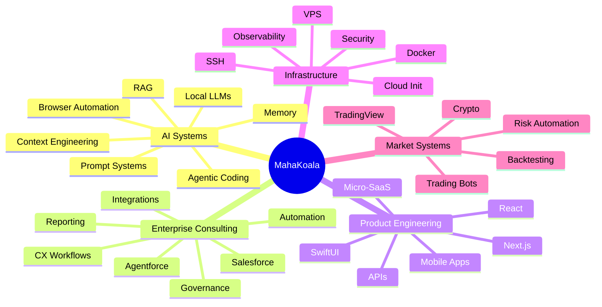
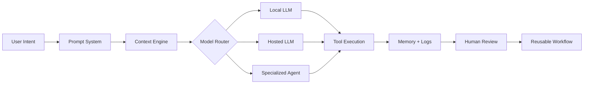
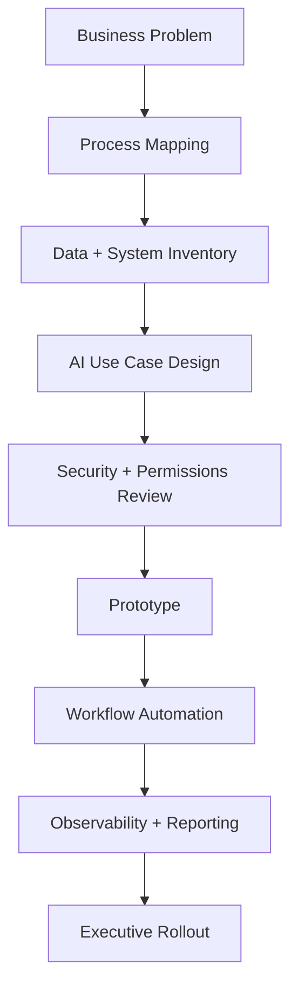
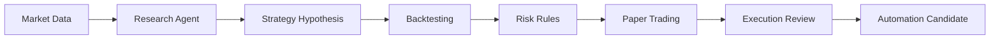
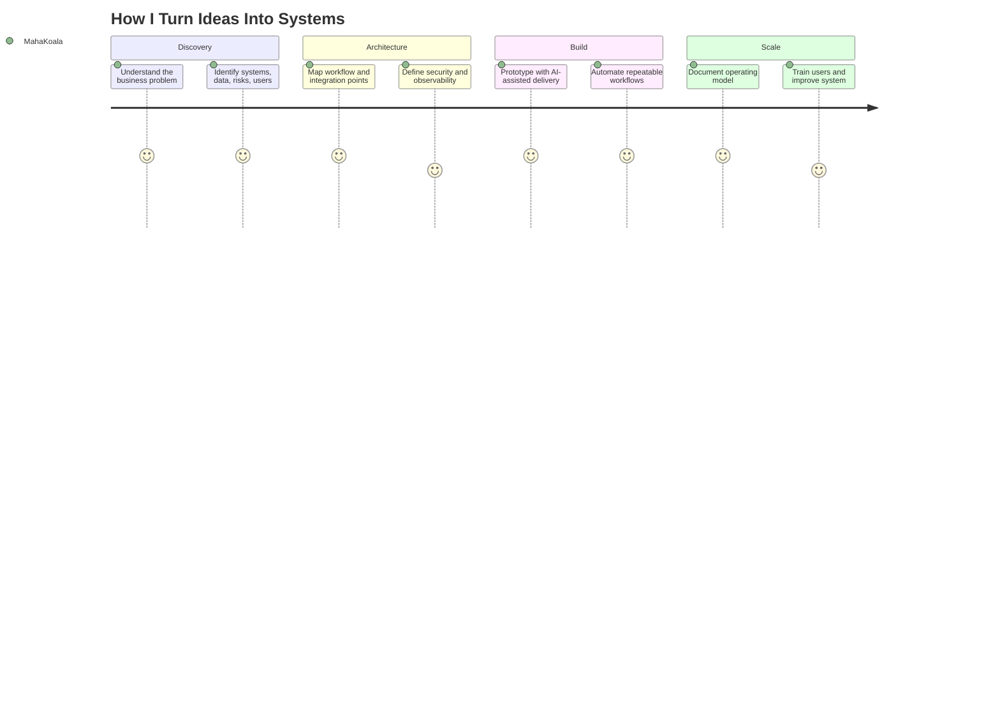
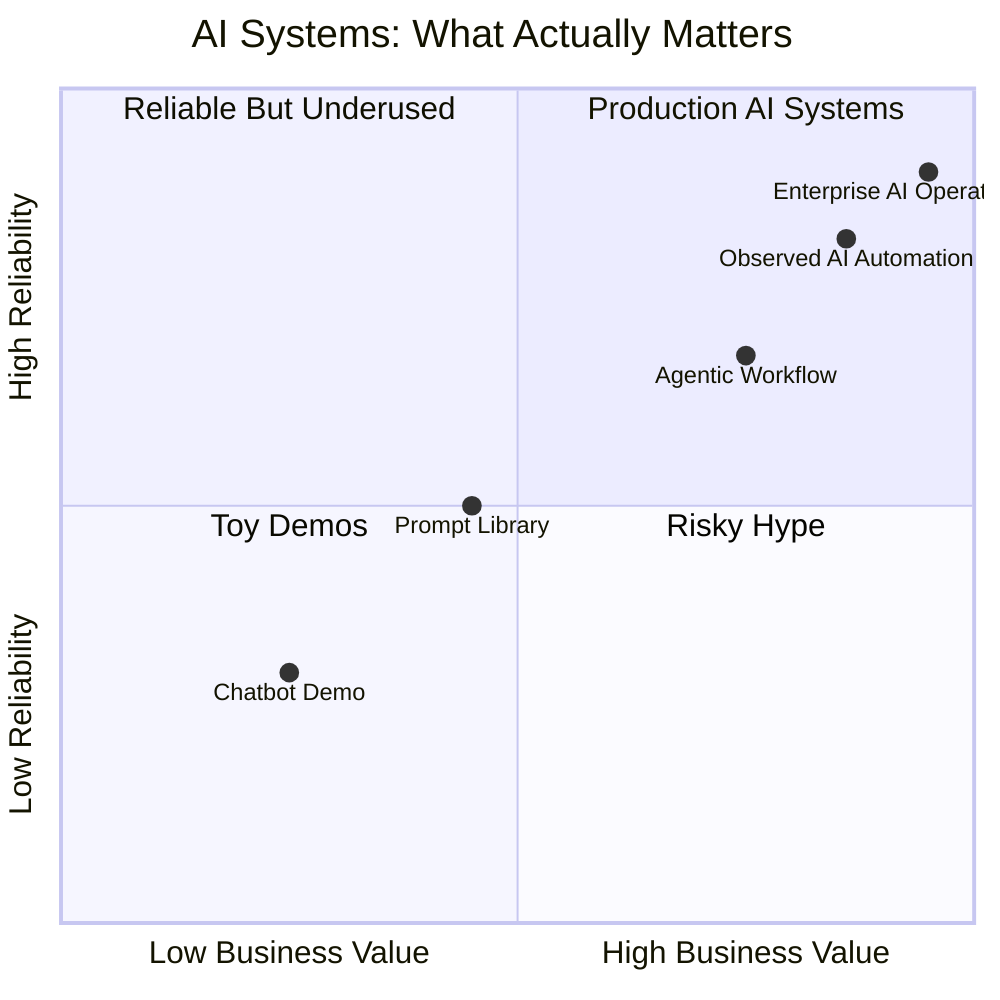

#  Hi, I’m MahaKoala

  

  
  
  
  

  
  

---

## Executive Snapshot

I build and study systems that turn **AI from a chat box into an operating layer**.

My work sits at the intersection of:

- **Agentic AI engineering**
- **Salesforce and enterprise automation**
- **Local-first LLM infrastructure**
- **RAG and knowledge systems**
- **Trading and market automation**
- **DevOps, VPS, and self-hosted tooling**
- **Micro-SaaS and founder operating systems**

> **The person you call when the AI demo needs to become a working product, a repeatable workflow, or a consultant-grade implementation plan.**

---

## Visual Operating Map

---

## Positioning

<table>
<tr>
<td width="33%" valign="top">

### 🧠 AI Architect

I design AI systems that can reason, retrieve, execute, observe, and improve.

</td>
<td width="33%" valign="top">

### 🏢 Enterprise Operator

I connect AI to real business systems, CRM workflows, security models, data pipelines, and team operations.

</td>
<td width="33%" valign="top">

### 🚀 Founder-Minded Builder

I think in leverage, speed, repeatability, monetization, and practical implementation.

</td>
</tr>
</table>

---

## Core Specializations

  
  
  
  
  

  
  
  
  
  

---

## What My GitHub Reflects

My GitHub is not just a repo list. It is a public research trail.

| Theme | What it says about me |
|---|---|
| **Agentic coding systems** | I study how Claude Code, Codex, OpenCode, Cursor, and autonomous coding agents can become reliable delivery systems. |
| **Spec-driven development** | I care about moving AI coding away from vibe coding and toward structured plans, repeatable workflows, and reviewable outputs. |
| **Local-first AI** | I explore private, cost-aware, hybrid model routing across local and hosted LLMs. |
| **RAG and knowledge systems** | I’m interested in retrieval, document intelligence, reasoning-based indexing, and persistent AI memory. |
| **Salesforce and Agentforce** | I connect enterprise CRM workflows with modern AI tooling, automation, agent skills, and business operations. |
| **Trading automation** | I evaluate market automation, TradingView workflows, backtesting, crypto bots, and risk-aware execution. |
| **DevOps and VPS tooling** | I build and collect infrastructure patterns for self-hosting, SSH, SFTP, cloud-init, Docker, and AI stack deployment. |
| **Founder systems** | I collect and build operating playbooks for micro-SaaS, consulting, launch systems, and career automation. |

---

## AI / ML Systems I Care About

I’m especially interested in AI systems that are:

- **Useful beyond the demo**
- **Observable**
- **Cost-aware**
- **Context-rich**
- **Safe enough for enterprise workflows**
- **Composable across tools**
- **Capable of repeatable execution**

---

## AI Stack

  

### Model & Agent Ecosystem

  
  
  
  
  
  
  
  
  
  

---

## Enterprise & CRM Stack

  
  
  
  
  
  

### Enterprise AI Pattern

---

## Developer Tooling

  
  
  
  
  
  
  
  
  
  

---

## Product Engineering

  
  
  
  
  
  
  
  
  

---

## Infrastructure & Self-Hosting

  
  
  
  
  
  
  

---

## Market & Trading Systems

  
  
  
  
  

---

## Consultant Delivery Model

---

## Repo Categories I’m Known For Exploring

| Category | Representative Focus |
|---|---|
| **AI Coding Agents** | Claude Code, Codex, OpenCode, status lines, task masters, multi-agent reviews |
| **Spec & Context Systems** | OpenSpec, context engineering, prompt kits, long-running autonomous development |
| **RAG / Knowledge AI** | Page indexing, document intelligence, memory plugins, retrieval workflows |
| **Salesforce AI** | Agentforce skills, Apex, Flow, LWC, SOQL automation, enterprise CRM intelligence |
| **Browser & Web Agents** | Browser harnesses, Firecrawl-style web extraction, AI task execution |
| **Infrastructure** | VPS setup, cloud-init, SSH, SFTP terminals, local and remote AI environments |
| **Trading Automation** | Crypto bots, TradingView MCP, backtesting, strategy execution |
| **Founder Tooling** | Career operations, micro-SaaS kits, launch systems, operator playbooks |

---

## My AI Philosophy

AI is not just about better models.

It is about:

- better workflows
- better context
- better tools
- better memory
- better routing
- better observability
- better business outcomes

The winning teams will not simply “use AI.”  
They will build repeatable operating systems around it.

---

## Featured Identity

  

---

## GitHub Stats

  
  

  

---

## GitHub Activity Graph

  

---

## GitHub Trophies

  

---

## Contribution Snake

<picture>
  <source media="(prefers-color-scheme: dark)" srcset="https://raw.githubusercontent.com/tobiasmeyhoefer/tobiasmeyhoefer/output/github-snake-dark.svg" />
  <source media="(prefers-color-scheme: light)" srcset="https://raw.githubusercontent.com/tobiasmeyhoefer/tobiasmeyhoefer/output/github-snake.svg" />
  
</picture>

---

## Private Work

Private enterprise and client implementation work stays private.

Public GitHub shows the research trail:  
what I’m evaluating, forking, testing, learning from, and combining into consultant-grade systems.

---

## Personal Thesis

> The next great consultant will not just recommend software.  
> They will design the AI-assisted operating system that lets the business move faster, think clearer, and execute with less friction.

That is what I’m building toward.

  

