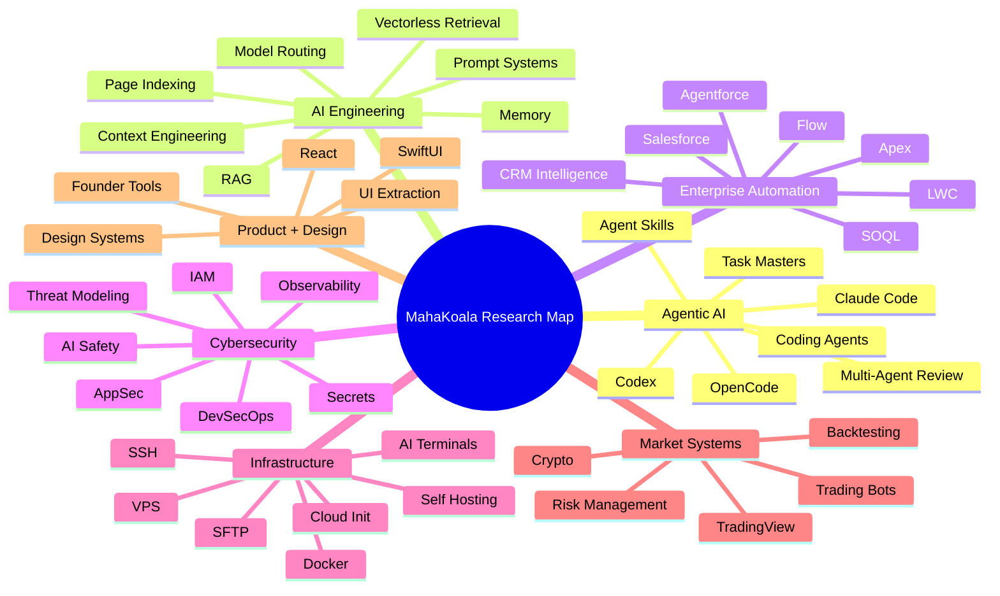
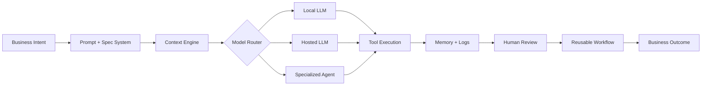
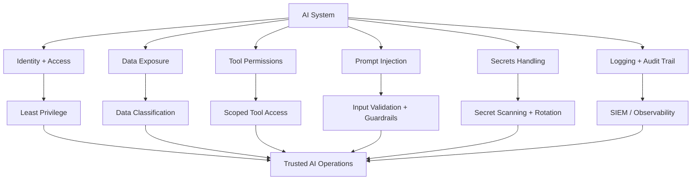
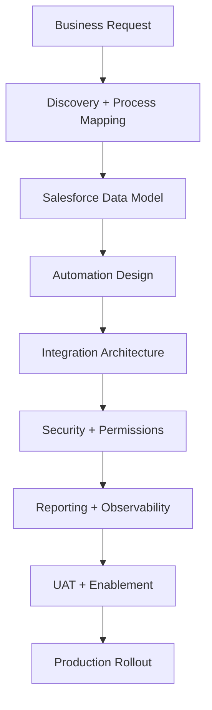
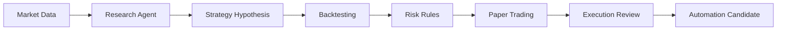
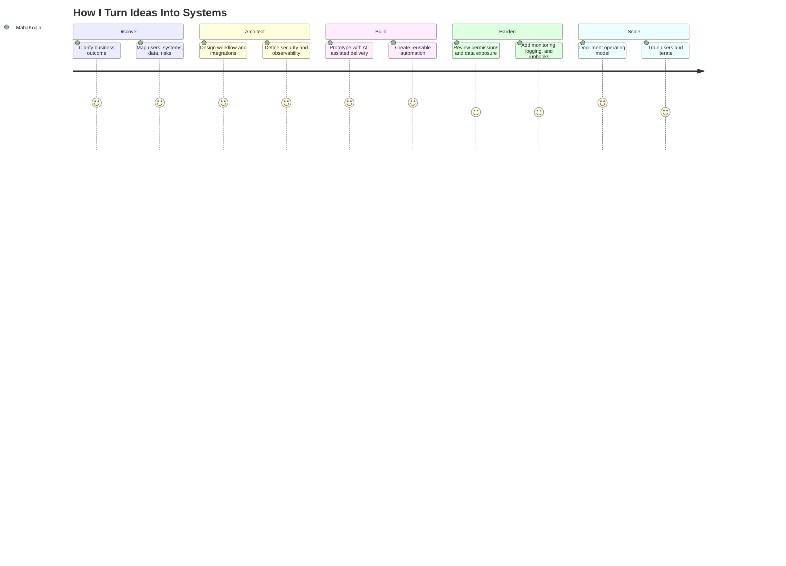
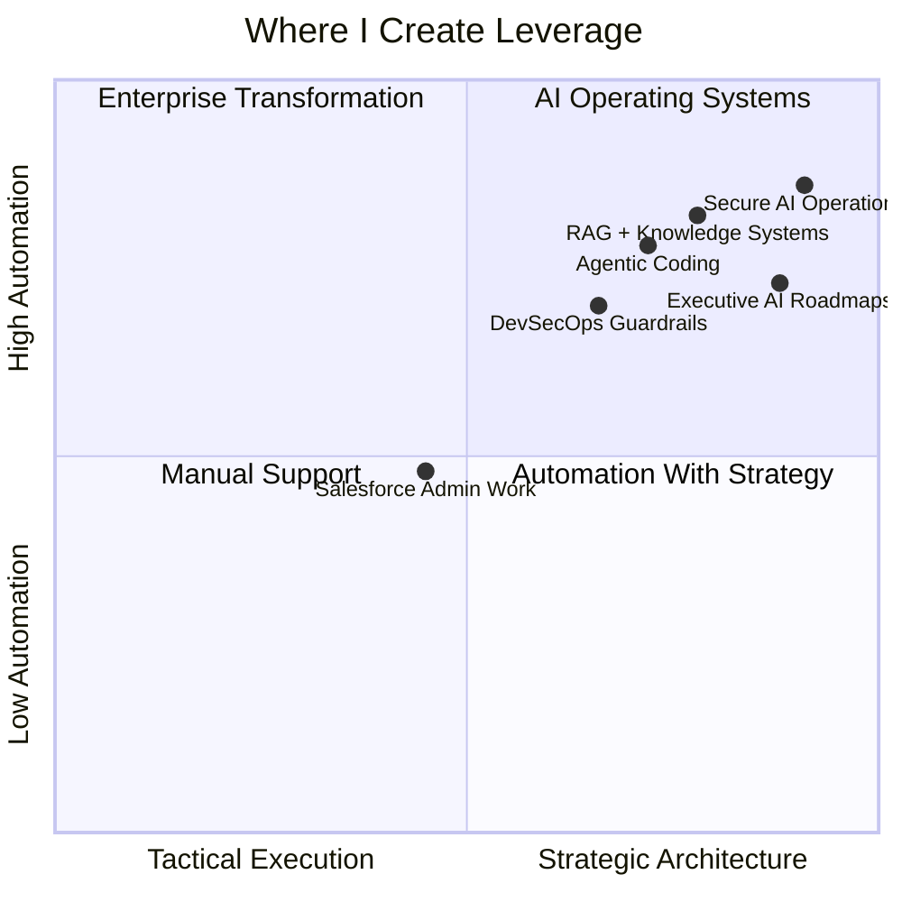

#  Hi, I’m MahaKoala

  

  
  
  
  
  

  
  

---

## Executive Snapshot

I build systems that turn **AI from a chat box into an operating layer**.

My GitHub is a public research map of the tools, frameworks, and patterns I study: agentic coding systems, local-first LLM workflows, RAG, Salesforce and Agentforce automation, AI-native DevOps, cloud terminals, cybersecurity tooling, trading automation, and founder/operator systems.

> **The person you call when the AI demo needs to become a secure, observable, repeatable, business-ready system.**

---

## What I’m Known For

<table>
<tr>
<td width="33%" valign="top">

### 

**Agentic AI Systems**

I design prompt systems, coding agents, RAG workflows, model routing, AI memory, and human-in-the-loop automation.

</td>
<td width="33%" valign="top">

### 

**Salesforce + Enterprise Automation**

I translate business complexity into CRM architecture, service workflows, integration plans, reporting models, and operational governance.

</td>
<td width="33%" valign="top">

### 

**Cybersecurity-Minded Delivery**

I care about secure-by-design systems: IAM, secrets, permissions, auditability, DevSecOps, secure SDLC, AI risk, and observability.

</td>
</tr>
</table>

---

## Public Research Signal

My stars, forks, and watched projects cluster around several practical research tracks:

---

## Starred Repository Intelligence

| Research Track | What the starred repos suggest | How I apply it |
|---|---|---|
| **Agentic coding** | Strong interest in Claude Code, Codex, OpenCode, statuslines, task managers, autonomous implementation runs, and agent harnesses. | Building structured AI development workflows that are observable, reviewable, and less fragile than vibe coding. |
| **Spec-driven development** | Repeated signal around OpenSpec, Spec Kit, long-running agent instructions, prompt systems, and context engineering. | Turning vague ideas into requirements, plans, implementation maps, and repeatable delivery systems. |
| **RAG and knowledge systems** | Interest in PageIndex, vectorless retrieval, document intelligence, memory plugins, and research assistants. | Designing retrieval and reasoning systems for documents, enterprise knowledge, and decision support. |
| **AI-native DevOps** | Stars around worktrees, containers, terminal agents, browser terminals, SSH/SFTP tools, and AI stack deployment. | Building local/cloud development environments that let agents safely operate inside real systems. |
| **Cybersecurity and trust** | Signal around secure automation, infrastructure visibility, access control, defensive tooling, monitoring, and AI tool risk. | Embedding permission models, audit trails, secrets hygiene, least privilege, and threat modeling into delivery. |
| **Salesforce + AI** | Strong alignment with Salesforce skills, Agentforce patterns, Apex, Flow, LWC, SOQL, and CRM automation. | Bringing AI into enterprise service workflows, CX operations, case routing, reporting, and integration architecture. |
| **Trading and market automation** | Stars around trading bots, backtesting, TradingView workflows, crypto tooling, and risk management. | Exploring AI-assisted financial research, backtesting, market data workflows, and disciplined automation. |
| **Product and design systems** | Stars around AI design systems, UI extraction, prototype generation, and brand-grade design automation. | Turning product ideas into clean interfaces, design tokens, prototypes, and implementation-ready specs. |

---

## AI Operating Layer

I care about AI systems that are:

- **Useful beyond the demo**
- **Context-rich**
- **Observable**
- **Cost-aware**
- **Permission-aware**
- **Safe enough for enterprise workflows**
- **Composable across tools**
- **Designed for repeatable execution**

---

## Cybersecurity + AI Risk Model

---

## Core Skill Matrix

### AI / ML / Agentic Systems

  
  
  
  
  
  

### Model + Agent Ecosystem

  
  
  
  
  
  
  
  
  
  
  

---

## Cybersecurity Skill Sets

  
  
  
  
  
  

| Domain | Practical capability |
|---|---|
| **Application Security** | OWASP-aware design, secure API patterns, input validation, auth flows, permission boundaries, dependency risk awareness. |
| **AI Security** | Prompt injection awareness, tool-use risk, MCP/agent permission scoping, data leakage prevention, model output review patterns. |
| **Cloud Security** | IAM boundaries, least privilege, environment isolation, key rotation, cloud logs, and secure deployment posture. |
| **DevSecOps** | CI/CD hygiene, secret scanning, dependency scanning, GitHub security posture, release governance, branch protection thinking. |
| **Security Operations** | Monitoring, alerting, log forwarding, incident visibility, SOC/vendor handoffs, and operational runbooks. |
| **Salesforce Security** | Profiles, permission sets, connected apps, OAuth scopes, field/object access, audit trails, automation user governance. |
| **Data Protection** | Data classification, retention thinking, access reviews, customer data sensitivity, privacy-aware integrations. |

---

## Enterprise + Salesforce Capability

  
  
  
  
  
  

---

## Infrastructure + DevOps

  

  
  
  
  
  
  
  
  
  

---

## Product Engineering

  
  
  
  
  
  
  
  
  

---

## Trading + Decision Systems

  
  
  
  
  

---

## Job Skill Sets I Bring

| Role Signal | Skill Set |
|---|---|
| **AI Systems Consultant** | LLM strategy, agent workflows, tool orchestration, AI adoption plans, AI governance, executive communication. |
| **Solutions Architect** | System design, integration mapping, API architecture, data flow modeling, platform selection, implementation planning. |
| **Salesforce Architect / Product Owner** | CRM automation, case workflows, service operations, object/data modeling, Flow/Apex/LWC collaboration, stakeholder delivery. |
| **AI Engineer / Agent Builder** | RAG, prompt systems, coding agents, local LLM routing, memory, eval loops, context engineering. |
| **DevSecOps-Minded Builder** | CI/CD thinking, secrets hygiene, security posture, IAM, monitoring, deployment safety, production readiness. |
| **Business Analyst / Operator** | Requirements gathering, process maps, Jira-ready stories, acceptance criteria, documentation, UAT, executive updates. |
| **Technical Product Consultant** | MVP planning, product architecture, monetization paths, design systems, roadmap creation, launch readiness. |
| **Automation Strategist** | Workflow automation, scripting, n8n/Zapier-style orchestration, AI-assisted operations, repeatable playbooks. |

---

## Consultant Delivery Flywheel

---

## Capability Radar

---

## AI Philosophy

AI is not just about better models.

It is about:

- better workflows
- better context
- better tools
- better memory
- better routing
- better observability
- better permissions
- better business outcomes

The winning teams will not simply “use AI.”  
They will build repeatable operating systems around it.

---

## Featured Identity

  

---

## GitHub Stats

  
  

  

---

## GitHub Activity Graph

  

---

## GitHub Trophies

  

---

## Contribution Snake

<picture>
  <source media="(prefers-color-scheme: dark)" srcset="https://raw.githubusercontent.com/tobiasmeyhoefer/tobiasmeyhoefer/output/github-snake-dark.svg" />
  <source media="(prefers-color-scheme: light)" srcset="https://raw.githubusercontent.com/tobiasmeyhoefer/tobiasmeyhoefer/output/github-snake.svg" />
  
</picture>

---

## Private Work

Private enterprise and client implementation work stays private.

Public GitHub shows the research trail:  
what I’m evaluating, forking, testing, learning from, and combining into consultant-grade systems.

---

## Personal Thesis

> The next great consultant will not just recommend software.  
> They will design the AI-assisted operating system that lets the business move faster, think clearer, execute safely, and scale with less friction.

That is what I’m building toward.

  

